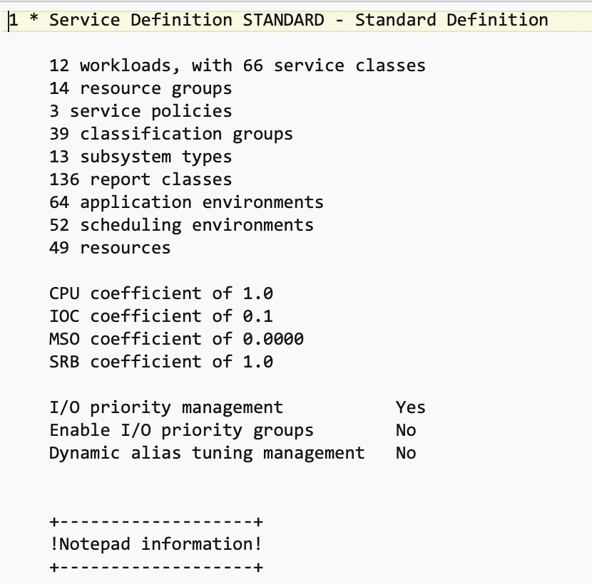
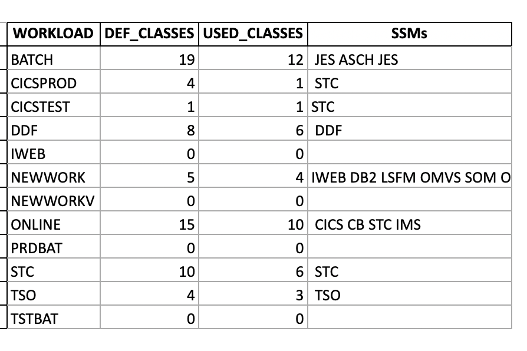

# wlmreport
z/OS WLM report tool to inspect WLM Report File with Python. Tested with z/OS 2.2.




## Install
Install as package using
```
    pip install -e .
```
from this directory.

## Using it
 1. Start ISPF WLM Dialog and generate print file of service definition
 1. Download the resulting textfile into your python Environment
 1. Enter your python shell (e.g. ipython) and run
```python
    import wlmreport
    sd = wlmreport.Servicedefinition(<path to service definion file>)
    # explore the sd object:
    sd.applenvs.values()
    sd.repclasses.values()
    sd.clfgroups.values()
    sd.resgroups.values()
    sd.serviceclasses.values()
    sd.workloads.values()
    sd.policies.values()
    sd.schedenvs.values()
    sd.ssmtypes.values()
    #
    # or export to excel file (needs openpyxl):
    #
    sd.to_excel('sd.xslx') 
```

